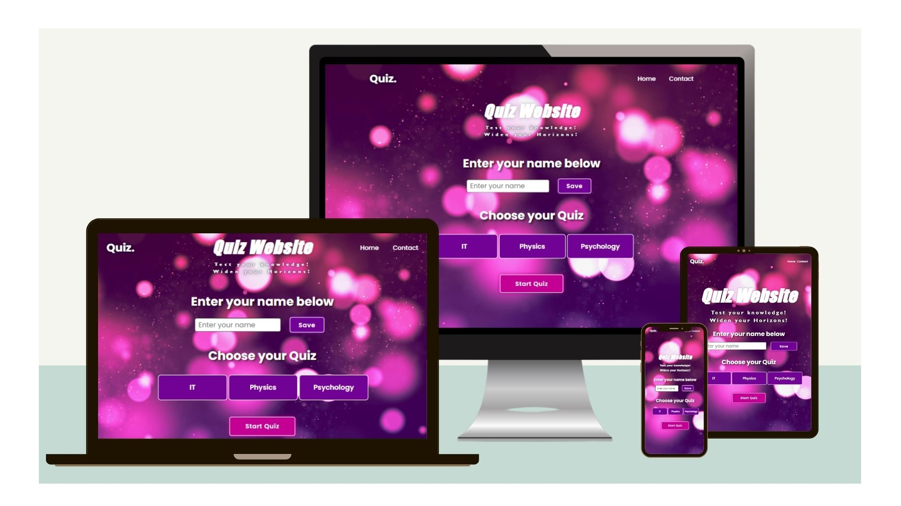
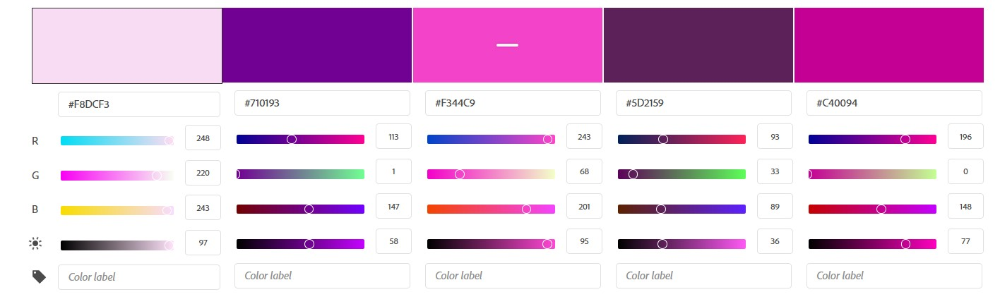
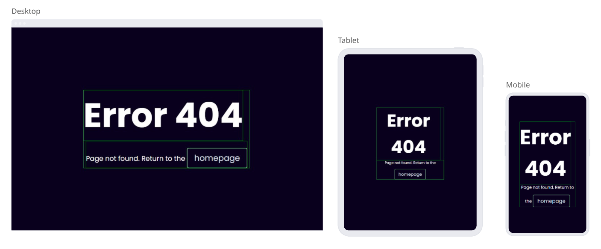

# Quiz Website
(Developer: Nataliia Illiashenko)

[Live webpage](https://natallllyyy333.github.io/PP2Quiz/)

## Table of Content

1. [Project Goals](#project-goals)
    1. [User Goals](#user-goals)
    2. [Site Owner Goals](#site-owner-goals)
2. [User Experience](#user-experience)
    1. [Target Audience](#target-audience)
    2. [User Requirements and Expectations](#user-requirements-and-expectations)
    3. [User Stories](#user-stories)
    4. [Site Owner Stories](#site-owner-stories)
3. [Design](#design)
    1. [Design Choices](#design-choices)
    2. [Colour](#colours)
    3. [Fonts](#fonts)
    4. [Structure](#structure)
    5. [Wireframes](#wireframes)
4. [Technologies Used](#technologies-used)
    1. [Languages](#languages)
    2. [Frameworks & Tools](#frameworks-&-tools)
5. [Features](#features)
6. [Testing](#validation)
    1. [HTML Validation](#HTML-validation)
    2. [CSS Validation](#CSS-validation)
    3. [JavaScript Validation](#javascript-validation)
    4. [Accessibility](#accessibility)
    5. [Performance](#performance)
    6. [Device testing](#performing-tests-on-various-devices)
    7. [Browser compatibility](#browser-compatability)
    8. [Testing user stories](#testing-user-stories)
8. [Bugs](#Bugs)
9. [Deployment](#deployment)
    1. [EmailJS API](#emailjs-api)
10. [Credits](#credits)
11. [Acknowledgments](#acknowledgments)

## Project Goals 
Quiz Website is a classic Quiz game with a chouice of 3 quizes: IT, Physics and Psychology. 

### User Goals
- Play a fun and engaging quiz game
- Test your general knowledge by answering questions on IT, Physics or Psychology.

### Site Owner Goals
- Creating a fun and engaging quiz qagme that users will want to play again and again.
- The game should be fully responsive to be able to be played on different devices.

## User Experience

### Target Audience
- casual gamers
- people who like quiz games
- people looking for a quick and easy yet engaging game 

### User Requirements and Expectations
- A simple and intuitive navigation system
- Quick, easy, and fun to play
- Links and functions that work as expected
- Good presentation and a visually appealing design regardless of screen size
- An easy way to leave feedback
- Accessibility

### User Stories
1. As a user, I want to be able to pick a quiz topic.
2. As a user, I want to test my general knowledge by answering different questions
3. As a user, I want to be able to pick the answer by clicking the mouse
4. As a user, I want to know what the correct answer was in case I don't guess it correctly
5. As a user, I want feedback on my correct answers
6. As a user, I want confirmation that my feedback was sent

### Site Owner Stories
7. As a site owner, I want users to be able to contact us or make suggestions for new questions or quizes .
8. As a site owner, I want users to be able to find us on social media.

## Design

### Design Choices
The game was designed to have a calming and relaxing effect on the user. Instead of the classic stick figure being hanged, the game uses flowers that lose petals. By doing so the negative connotation of the game being morbid or offensive is removed.

### Colour
The color palette was chosen to match the flowery theme of the background image. A color picker was used to pick colors from the background image, these colors were then further adjusted to meet accessibility criteria. 

Colour palette

### Fonts
For the fonts, Bootstrap's Native font stack was used. The phrase that is to be guessed monospace is used to avoid the words jumping from one line to the next and back depending on the guessed letter. 

### Structure
The page is structured in a user-friendly and easy-to-learn way. Upon arriving at the website the user sees a screen with the option to choose a difficulty for the game. The website consists of three separate pages:

- A homepage with 4 different views:
    - one for selecting a difficulty
    - one for playing the game
    - one that is shown after a correct guess
    - one that is shown after the user runs out of moves
- A contact form
- A 404 page

### Wireframes

Start screen

Game screen

Correct screen

Game over screen

Contact Us

Form confirmation

404 page

## Technologies Used

### Languages
- HTML
- CSS
- JavaScript

### Frameworks & Tools
- Bootstrap v5.0
- Git
- GitHub
- Gitpod
- Tinypng
- Paint.NET
- Balsamiq
- Font Awesome
- Favicon.io
- JSHint
- Lighthouse
- W3C Markup validation service
- W3C Jigsaw CSS validation service 
- WAVE WebAIM web accessibility evaluation tool
- EmailJS

## Features
The site consists of three pages and nine features

### Header
- Featured on all pages
- Consists of the game logo and game title

Header

