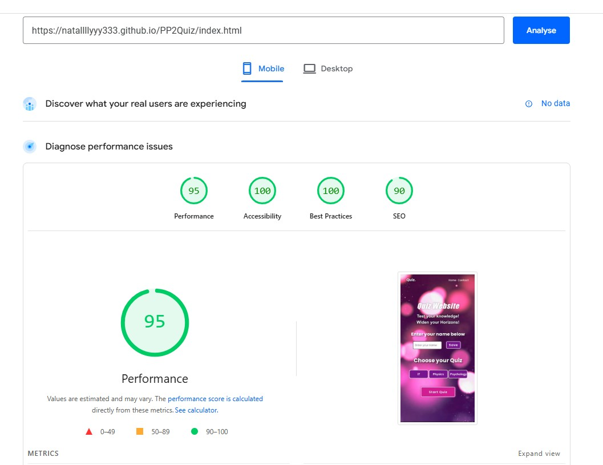

# Quiz Website
(Developer: Nataliia Illiashenko)

[Live webpage](https://natallllyyy333.github.io/PP2Quiz/)

## Table of Content

1. [Project Goals](#project-goals)
    1. [User Goals](#user-goals)
    2. [Site Owner Goals](#site-owner-goals)
2. [User Experience](#user-experience)
    1. [Target Audience](#target-audience)
    2. [User Requirements and Expectations](#user-requirements-and-expectations)
    3. [User Stories](#user-stories)
    4. [Site Owner Stories](#site-owner-stories)
3. [Design](#design)
    1. [Design Choices](#design-choices)
    2. [Colour](#colours)
    3. [Fonts](#fonts)
    4. [Structure](#structure)
    5. [Wireframes](#wireframes)
4. [Technologies Used](#technologies-used)
    1. [Languages](#languages)
    2. [Frameworks & Tools](#frameworks-&-tools)
5. [Features](#features)
6. [Testing](#validation)
    1. [HTML Validation](#HTML-validation)
    2. [CSS Validation](#CSS-validation)
    3. [JavaScript Validation](#javascript-validation)
    4. [Accessibility](#accessibility)
    5. [Performance](#performance)
    6. [Device testing](#performing-tests-on-various-devices)
    7. [Browser compatibility](#browser-compatability)
    8. [Testing user stories](#testing-user-stories)
8. [Bugs](#Bugs)
9. [Deployment](#deployment)
    1. [EmailJS API](#emailjs-api)
10. [Credits](#credits)
11. [Acknowledgments](#acknowledgments)

## Project Goals 
Quiz Website is a classic Quiz game with a chouice of 3 quizes: IT, Physics and Psychology. 

### User Goals
- Play a fun and engaging quiz game
- Test your general knowledge by answering questions on IT, Physics or Psychology.

### Site Owner Goals
- Creating a fun and engaging quiz qagme that users will want to play again and again.
- The game should be fully responsive to be able to be played on different devices.

## User Experience

### Target Audience
- casual gamers
- people who like quiz games
- people looking for a quick and easy yet engaging game 

### User Requirements and Expectations
- A simple and intuitive navigation system
- Quick, easy, and fun to play
- Links and functions that work as expected
- Good presentation and a visually appealing design regardless of screen size
- An easy way to leave feedback
- Accessibility

### User Stories
1. As a user, I want to be able to pick a quiz topic.
2. As a user, I want to test my general knowledge by answering different questions
3. As a user, I want to be able to pick the answer by clicking the mouse
4. As a user, I want to know what the correct answer was in case I don't guess it correctly
5. As a user, I want feedback on my correct answers
6. As a user, I want confirmation that my feedback was sent

### Site Owner Stories
7. As a site owner, I want users to be able to contact us or make suggestions for new questions or quizes .

## Design

### Design Choices
The game was designed to have an engaging effect on the user. The idea was to let the user check their common knowledge by playing a quiz game on 3 subjects: IT, Physics and Psychology.

### Colour
The color palette was chosen to match violet and purple colour of the background. A color picker was used to pick colors from the background image, these colors were then further adjusted to meet accessibility criteria. 

Colour palette

### Fonts
For the fonts, Poppins and Impact, Gill Sans font stack was used. 

### Structure
The page is structured in a user-friendly and easy-to-learn way. Upon arriving at the website the user sees a screen with the option to choose a subject for the quiz game. The website consists of three separate pages:

- A homepage with 4 different views:
    - one for selecting a subject
    - one for the Quiz Guide
    - one for playing the game
    - one that shows the score when the quiz is over
    - one that is shown after the user presses the button High Scores to see the 3 latest best results of the game
- A contact form
- A form confirmation view
<!-- - A 404 page -->

### Wireframes

Start screen

Guide screen

Game screen

Score screen

High Scores screen

Contact Us screen

Form confirmation screen

<!-- 

404 page

 -->

## Technologies Used

### Languages
- HTML
- CSS
- JavaScript

### Frameworks & Tools
- Bootstrap v5.0
- Git
- GitHub
- Gitpod
- Tinypng
- Paint.NET
- Balsamiq
- Font Awesome
- Favicon.io
- JSHint
- Lighthouse
- W3C Markup validation service
- W3C Jigsaw CSS validation service 
- WAVE WebAIM web accessibility evaluation tool
- EmailJS
- Miro

## Features
The site consists of two pages and nine features

### Header
- Featured on all pages
- Consists of the game logo, a websit title, a moto and a nav bar on the Home paga and consists of the game logo and a nav bar on the Contact Us page

Header

### Start screen
- Provides an option to choose between three different game subjects.
- Allows a user to choose a username and enter it in the game.
- User story covered: 1

Start screen

### Game screen
- Consists of 6 different sections:
    - A web site title
    - The current quiz subject 
    - A section with the current score and the h-score  
    - The quiz current question 
    - Options to chose from the answer options
    - Answer number of total number of questions
    - A button "Next" to go to the next question

    - User stories covered: 4
    - User stories covered: 2, 3

Game screen

### Game Score screen
- Consists of four sections

    - Screen title - "Quiz Result"
    - The quiz total score in percens in a round diagram, representing the score 
    - A section with the username and the total score and the h-score  
    - A button section with buttons "High Scores" to go to the High Scores Screen, a button "Try Again" - to start the same quiz with the same user name again and a button "Go To Home" to go bac to the Start Screen

    - User stories covered: 4

Game Score

### High Scores screen
- Consists of four sections
    - Screen title - "Best of the Best" with crowns pictograms
    - A section with three latest playes, their the scores in the descending order, date and time of their games
    - Button "Back to score" to go back to the user's score

- User story covered: 5

Correct Guess screen

### Contact form
- A way for the user to provide feedback
- Consists of five sections
    - Title with a question to the user - "Questions? - Send us a message." 
    - An input section for a user to enter their name
    - An input section for a user to enter their email
    - An area input section for a user to enter their feedback
    - Button "Send Message" 
- User story covered 7 

Contact Form

### Form confirmation
- Provides the user with feedback after the form has been submitted 
- User story covered: 6

Form confirmation

<!-- ### 404 message
- Provides the user with a way to return to the game after clicking on a broken link

404 message

 -->

## Validation

### HTML Validation
The W3C Markup Validation Service was used to validate the HTML of the website. All pages pass with no errors no warnings to show.

Home

Contact Us

<!-- 

404

 -->

### CSS Validation
The W3C Jigsaw CSS Validation Service was used to validate the CSS of the website. When validating the page as a whole, the validator shows some errors linked to Bootstrap v5.0. When validating just my custom CSS it passes with no errors.

Full page

style.css

### JavaScript Validation
JSHint Static Code Analysis Tool for JavaScript was used to validate the Javascript files. No significant issues were found.

script.js

js-validation-scriptpost.js

questionsPsychology.js

questionsPhysics.js

questions.js

### Accessibility
The WAVE WebAIM web accessibility evaluation tool was used to ensure the website met high accessibility standards. All pages pass with 0 errors.

Home

Contact

<!-- 

404

 -->

### Performance 
Google Lighthouse in Google Chrome Developer Tools was used to test the performance of the website.

Home

Contact

<!-- 

404

 -->

### Performing tests on various devices 
The website was tested on the following devices:

- Lenovo Yoga 2 Pro (both in pc and tablet mode)
- Honor 20 pro
- Xiaomi Redmi Note 7

In addition, the website was tested using the Google Chrome Developer Tools Device Toggling option for all available device options.

### Browser Compatability
The website was tested on the following browsers:

- Google Chrome
- Mozilla Firefox
- Microsoft Edge

### Testing user stories

1. As a user, I want to be able to create my name and enter it in the game

| **Feature** | **Action** | **Expected Result** | **Actual Result** |
|-------------|------------|---------------------|-------------------|
| Start screen | Type the name into the username input and click the 'Save' button | The start screen shows the greeting with the user's name | Works as expected |

Screenshots

2. As a user, I want to be able to pick a subject for the game

| **Feature** | **Action** | **Expected Result** | **Actual Result** |
|-------------|------------|---------------------|-------------------|
| Start screen | Click on the desired subject button|The start screen shows a notification with the picked subject The games screen loads with the desired subject | Works as expected |

Screenshots

3. As a user, I want to be able to read the quide for the game before playing

| **Feature** | **Action** | **Expected Result** | **Actual Result** |
|-------------|------------|---------------------|-------------------|
| Start screen | Click on the 'Start Quiz' button|The Guide screen loads with the text of the Guide | Works as expected |

Screenshots

4. As a user, I want to test my general knowledge by answering different questions

| **Feature** | **Action** | **Expected Result** | **Actual Result** |
|-------------|------------|---------------------|-------------------|
| Guide screen | Click the 'Start Quiz' button to start the game | The Quiz Game screen loads  | Works as expected |

Screenshots

5. As a user, I want to be able to exit before the start of the game back to the Start Screen

| **Feature** | **Action** | **Expected Result** | **Actual Result** |
|-------------|------------|---------------------|-------------------|
| Guide screen | Click the 'Exit Quiz' button to exit the game | The Start screen loads  | Works as expected |

Screenshots

6. As a user, I want to be able to pick the option of the answers by clicking the mouse and see if my answer was right or wrong

| **Feature** | **Action** | **Expected Result** | **Actual Result** |
|-------------|------------|---------------------|-------------------|
| Game screen | Click an option button | The used answer change color to green if it is correct or to red if it is wrong. Another option can't be picked a second time | Works as expected |

Screenshots

7. As a user, I want to know what the correct answer was in case I don't guess it correctly

| **Feature** | **Action** | **Expected Result** | **Actual Result** |
|-------------|------------|---------------------|-------------------|
| Game screen | Click an option button | If the answer was wrong, the right answer turns to green to be shown to the user. | Works as expected |

Screenshots

8. As a user, I want to be able to go to the next question of the quiz

| **Feature** | **Action** | **Expected Result** | **Actual Result** |
|-------------|------------|---------------------|-------------------|
| Game screen | Click the 'Next' button | The screen of the next question of the quiz loads. | Works as expected |

Screenshots

9. As a user, I want to know my score at the end of the game

| **Feature** | **Action** | **Expected Result** | **Actual Result** |
|-------------|------------|---------------------|-------------------|
| Game screen | Click the 'Next' button on the last question screen | The screen of the Game Score loads. | works as expected |

Screenshots

10. As a user, I want to know the high scores of the game

| **Feature** | **Action** | **Expected Result** | **Actual Result** |
|-------------|------------|---------------------|-------------------|
| Score screen | Click the 'High Scores' button  | The screen of the High Scores loads. | works as expected |

Screenshots

11. As a user, I want to go to the feedback page to send my feedback to the site owner 

| **Feature** | **Action** | **Expected Result** | **Actual Result** |
|-------------|------------|---------------------|-------------------|
| Start screen | click the 'Contact' link on the nav bar| A Contact page loads | Works as expected | 

Screenshots

12. As a user, I want to send my feedback to the site owner and see the confirmation that my feedback was sent

| **Feature** | **Action** | **Expected Result** | **Actual Result** |
|-------------|------------|---------------------|-------------------|
| Contact page Form Screen | Fill out the contact form and click the submit button | A thank you message is displayed | Works as expected | 

Screenshots

13. As a site owner, I want users to be able to contact us or make suggestions for new phrases.

| **Feature** | **Action** | **Expected Result** | **Actual Result** |
|-------------|------------|---------------------|-------------------|
| Start screen | click the 'Contact' link on the nav bar| A Contact page loads | Works as expected | 

Screenshots

